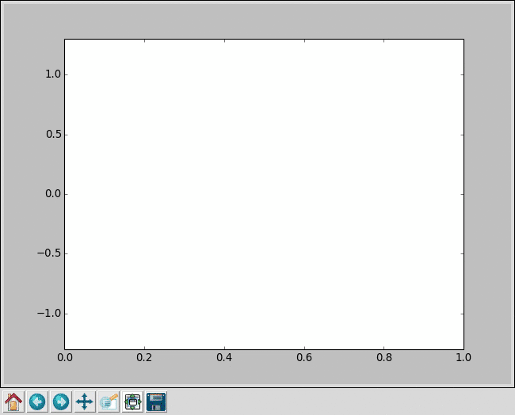

# learn sin (x)

## 多層パーセプトロンでsin(x)を学習する。
$$ y=sin(x) $$
について、教師データ$(x_0,y_0),(x_1,y_1),....,(x_n,y_n)$を用意し、学習する。




使用したニューラルネットは以下のような構造にした。
```python
class xyFunc(chainer.Chain):
    def __init__(self, n_in, n_units, n_out):
        super(xyFunc, self).__init__(
            l1=L.Linear(n_in, n_units),
            l2=L.Linear(n_units, n_out)
        )
    def __call__(self, x):
        h1 = F.relu(self.l1(x))
        h2=2*F.tanh(self.l2(h1))
        return h2
```

入力、バイアスの1とxの値。

1層目は、線形変換してからReLUに通す。
2層目は、非線形な関数としてtanhを利用し、$sin(x)$の値域がゆとりを持って出力に含まれるよう、2倍をした。

200世代までの学習結果が画像。
